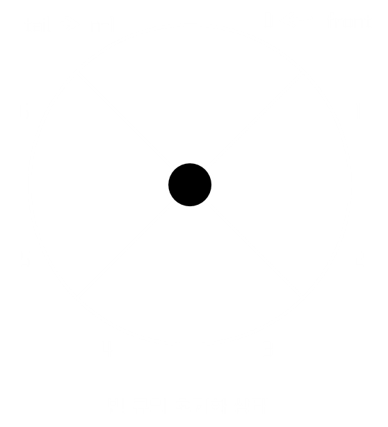
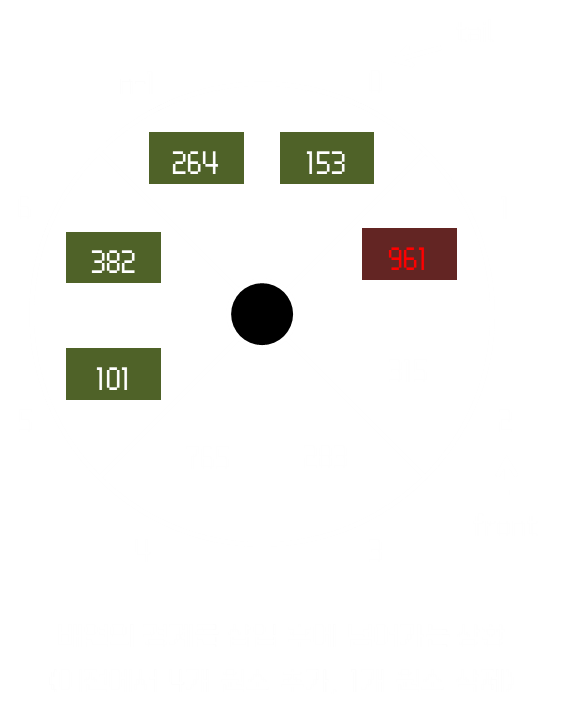
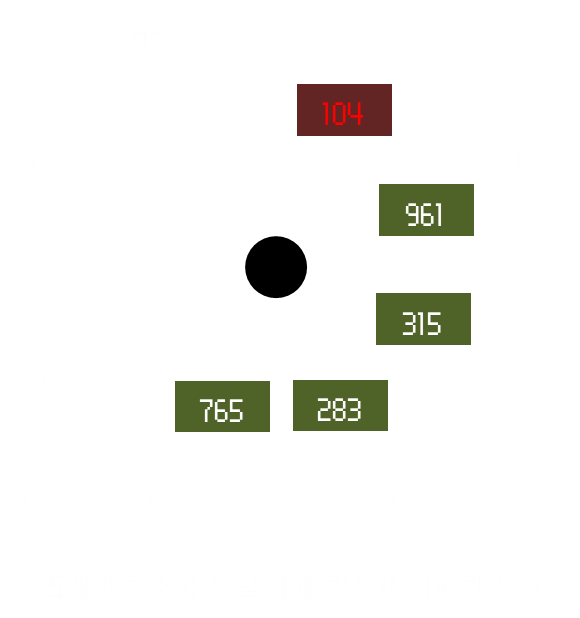

# 배열을 이용한 큐
## 배열 큐의 객체 구조
큐를 위한 배열 `queue[0...n-1]`을 활용하자.   
- 변수 `front`는 큐에 가장 먼저 들어온 맨 앞 원소의 인덱스이다.
- `tail`은 가장 늦게 들어온 맨 뒤 원소의 인덱스이다.

큐의 최대 크기를 예상할 수 있다면 배열이 적합하지만 예상할 수 없는 경우 운영하다 옮겨야 하는 단점이 있다.   
그럼에도 배열 기반 큐는 간명함과 효율성이 뛰어나므로 많이 사용된다.

임의의 배열 큐 구조에 대해서 하나의 객체(Class)로서 정의된다고 했을 때, 구조는 다음과 같다:
- **필드** : `queue[]`, `numItems`, `front`, `tail`
    - `queue[]` : 스택의 원소들이 저장되는 배열
    - `numItems` : 큐의 총 원소 수를 저장
    - `front` : 큐의 맨 앞 원소 인덱스를 저장
    - `tail` : 큐의 맨 뒤 원소 인덱스를 저장
- **메소드** : `enque(x)`, `dequeue()`, `front()`, `isEmpty()`, `dequeueAll()`
    - `enque(x)` : 큐의 끝에 원소 x를 삽입한다.
    - `dequeue()` : 큐의 맨 앞 원소를 알려주고 삭제한다.
    - `front()` : 큐의 맨 앞 원소를 알려준다.
    - `isEmpty()` : 큐가 비었는지 알려준다.
    - `dequeueAll()` : 큐를 비운다.

## 배열 큐의 작업 : (1) 큐 초기화


일반적으로 빈 큐를 표현할 때는 배열을 원형으로 해석하는 것이 편하다.   
큐를 위한 배열을 할당받아서 `numItems`로 원소 개수를 체크하는 것도 동일하고, 삽입과 삭제 구조도 동일하다.   
하지만, 큐 구조는 자칫 공간 사용의 비효율이 심해질 수 있는데 할당받은 배열 공간의 맨 끝에 오면 **큐가 꽉 찬 상태로 간주**&ZeroWidthSpace;하는 잘못된 방식을 사용하는 경우이다.   
앞쪽 공간이 비어 있음에도 이를 활용하지 못하면 극단적 예시로 10만 개 원소를 담은 배열의 맨 뒤에 두 개만 차 있음에도 큐가 꽉 차 있다고 간주할 수도 있다.
그러므로 배열을 원형으로 해석하여 **`n-1` 인덱스 뒤에 `0`이 위치하고 있다**&ZeroWidthSpace;라고 해석하면 된다.

### 큐 초기화의 ADT 구조
```
front <- 1
tail <- queue.length-1
numItems <- 0
```

## 배열 큐의 작업 : (2) 원소 삽입
큐의 원소를 삽입할 때는 **tail 값을 1 증가시키고** 그 자리에 새 원소를 저장하면 된다.   
여기에서 주의할 점은, 원소를 삽입했을 때 배열의 크기를 넘을 경우를 가정해야 한다.



우리는 배열의 경계를 삽입 후에 넘어가게 되면 queue.length-1 다음에 0으로 넘어가기로 했다.   
그러므로, `tail++` 대신에 `tail <- (tail+1)%queue.length`를 사용하면 된다.   
다만, 이 경우 큐 공간이 꽉 차진 않았는지 `isFull()` 메소드를 통해 확인하고 삽입해야 한다.
그런 다음 총 원소 수를 1 증가시키면 된다.

### 원소 삽입의 ADT 구조
```
enqueue(x):
    if ( isFull() ) /* 에러 처리 */
    else
        tail <- (tail+1) % queue.length
        queue[tail] <- x
        numItems++
```

### 큐가 꽉 차있는지 확인하기 위한 ADT 구조
```
isFull():
    if (numItems = queue.length)
        return true
    else return false
```

## 배열 큐의 작업 : (3) 원소 삭제


큐의 원소를 삭제하는 것은 가장 먼저 들어온 원소를 기준으로 한다고 했다.    
그러므로 **front의 원소를 삭제(리턴)하고** front를 1 증가시킨다.   
포인트는 **여기서도 배열의 경계를 넘어갈 수 있다는 것에 유의하여** 나머지 연산을 활용한다.
동시에 삭제하려는데 큐가 비어 있으면 안 되므로 체크는 해야 한다. (`isEmpty()` 메소드)
마지막으로 `numItems`를 1 감소시키면 된다.

### 원소 삭제의 ADT 구조
```
dequeue():
    if (isEmpty()) /* 에러 처리 */
    else
        queueFront <- queue[front]
        front <- (front+1) % queue.length
        numItems--
        return queueFront
```

### 큐가 비었는지 확인하기 위한 ADT 구조
```
isEmpty():
    if (numItems = 0)
        return true
    else return false
```

## 기타 배열 큐의 작업
큐의 맨 앞 원소를 알려주는 함수 `front()`
```
front():
    if (isEmpty()) /* 에러 처리 */
    else return queue[front]
```

큐를 완전히 비우는 함수 `dequeueAll()`은 초기화와 같은 로직이다.
```
dequeueAll():
    front <- 1
    tail <- queue.length - 1
    numItems <- 0
```

## 구현
JAVA를 활용해 구현한 코드는 Normal-Coding-Studies/Data-Structure-With-JAVA/Data-Structure/out/production/Data-Structure/queue 내에 있다.