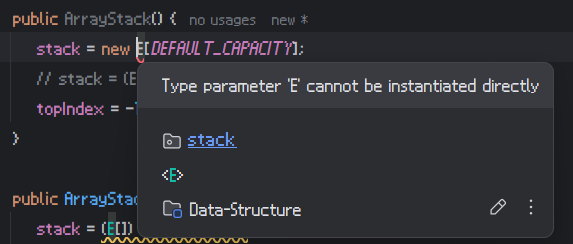

# 자바 클래스는 제네릭 타입의 객체를 생성할 수 없다
## 제네릭 파라미터 초기화 안됨?
자료구조를 JAVA를 통해 구현한 코드 중, 스택의 구현 코드를 잠시 보자.

```java
public class ArrayStack<E> implements StackInterface<E> {
    private E[] stack;
    private int topIndex;
    private static final int DEFAULT_CAPACITY = 64;
    
    public ArrayStack() {
        stack = new E[DEFAULT_CAPACITY];
        topIndex = -1;
    }
    
    public ArrayStack(int n) {
        stack = (E[]) new Object[n];
        topIndex = -1;
    }
    ...
}
```

여기에서 보면, 이상한 점이 두 군데 있다.
- `stack = new E[DEFAULT_CAPACITY];`
- `stack = (E[]) new Object[n];`

생성자가 오버로딩 되어있는데, 기본 스택 배열을 만드는 것이 다르게 적혀 있다.
안타깝게도, 이들 중 하나는 **작동하지 않는다.**



**Type parameter 'E' cannot be instantiated directly**  
분명 제대로 선언한 것 같은데도 사용이 불가능하다는 방식으로 에러를 띄운다.
자바는 제네릭 파라미터 타입의 `new`를 활용한 **객체 생성** 자체를 인정하지 않는다.
변수가 `E` 타입의 배열이나 객체를 레퍼런스하는 선언까지는 받아주지만 생성하는 선언은 통과시키지 않는다.

## 웨안됌?
제네릭 파라미터의 배열이나 객체에 대한 초기화가 불가능한 이유는 여러 가지가 있다.

1. 타입 소거(Type Erasure) - 런타임에 타입이 존재하는가? 
2. 고정된 크기와 타입의 배열 특성과 충돌
3. 타입 안전성(Type-Safety) 문제

### 타입 소거(Type Erasure) - 런타임에 타입이 존재하는가?
자바의 제네릭은 **타입 소거(Type Erasure)** 매커니즘을 사용한다.
즉, 컴파일 타임에 제네릭 타입 정보가 제거되고, 실행 시점에서는 제네릭 타입을 특정한 원시 타입(`Object` 등)으로 변환한다.
```java
List<String> list = new ArrayList<>();
```
다음과 같은 코드가 있다고 가정하자.
컴파일 타임에 `List<String>`은 `List`로 변환되며, 타입 파라미터 `String`은 `Object`로 처리된다.
이로 인해 제네릭 파라미터가 실제로 존재하는 타입 정보는 **런타임 시점에서는 알 수 없다.**
타입이 이런 방식으로 소거되기 때문에 배열 생성에는 제네릭 타입을 사용할 수 없다.
```java
T obj = new T();
```
이런 식으로 작성되면 컴파일 에러가 발생하는데, 컴파일 타임에 `T`가 무엇인지 알 수 없으므로 객체 생성이 불가능하다.
전술하였듯 실제 어떤 클래스 타입인지 정보를 알 수 없기 때문이다.
> 즉, 제네릭의 타입 검증은 **컴파일 타임** 에 진행하기 때문에 **런타임 시점** 에서는 타입 정보를 알 수 없다는 특성으로 인한 것이다.
> 그래서 Java는 제네릭 타입의 인스턴스 생성 방법을 제공하지 않는다.

### 고정된 크기와 타입의 배열 특성과 충돌
덧붙여, 배열은 런타임 시전에 실제 타입을 알아야 한다.
**고정된 크기와 고정된 타입의 요소를** 가지는 것이 배열의 특징인데, 제네릭 타입은 이 점에서 모호성이 높다.
게다가 실제 타입을 모른다면 해당 타입에 대한 **메모리를 할당할 수가 없다.**
예를 들어, `E[] array = new E[10]`이라면 어떤 타입인지 어떻게 알고 메모리를 할당하겠는가?
그래서 제네릭 타입 파라미터는 배열 초기화에는 특히 사용될 수 없다.

### 타입 안정성(Type-Safety) 문제
제네릭 타입을 설령 배열이나 객체 초기화에 사용한다고 가정하자.
그래도 런타임에서는 타입 정보를 알 수 없으므로 **타입 안정성** 문제가 발생할 수 있다.
예를 들어 `T[]` 배열을 만들었다면 `T`가 `String`인데 `Integer`을 담아도 실행이 되는 이상한 문제가 발생한다.
그래서 아예 객체나 배열의 타입을 안정적으로 일치시키기 위해 생성(`new`) 연산자에 제네릭 타입 파라미터의 사용을 제한하는 것이다.

## 어케함?
대체 방법에 대해 배열과 객체에 대한 방법이 있다.

### 배열의 경우 : 컬렉션 프레임워크를 사용하자
```java
T[] array = new T[10]; // 컴파일 에러
List<T> list = new ArrayList<>(); // 제네릭 리스트
```
컬렉션 프레임워크는 제네릭 타입을 안전히 다룰 수 있고 동적 크기를 지원한다.
이 경우 타입 소거로 인한 문제에서 자유로우며 런타임에서도 안전히 처리할 수 있다.

### 객체의 경우 : 생성자에서 타입 정보를 전달하거나 파라미터로 타입을 전달하자
```java
T obj = new T(); // 컴파일 에러
```
위와 같은 코드는 위에서 말했듯 사용할 수 없다.
그래서 제네릭 타입 파라미터를 생성자나 메소드를 통해 전달해야 한다.

```JAVA
class MyClass<T> {
    T value;
    
    MyClass(Class<T> clazz) {
        try {
            value = clazz.getDeclaredConstructor().newInstance();
        } catch (Exception e) {
            e.printStackTrace();
        }
    }
}
```
`T`의 타입을 `Class<T>`로 받아와서 `newInstance()` 메소드를 통해 객체를 생성할 수 있다.
반영(Reflection)을 사용하여 타입을 처리하는 방식이다.

```java
class MyClass<T> {
    T value;
    
    MyClass(T value) {
        this.value = value;
    }
}
```
`T`라는 제네릭 타입을 생성자 호출 시점에 명시적으로 전달받으면 된다.
이 경우 타입 안전성을 보장하면서 객체 초기화가 가능하다.